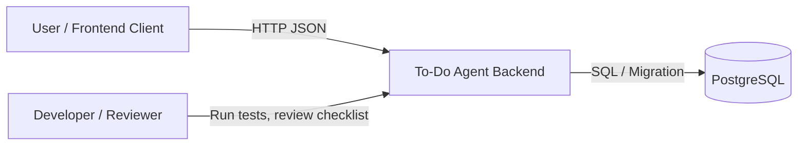
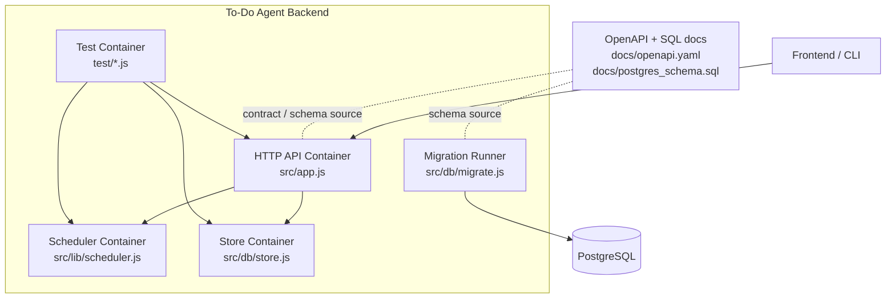
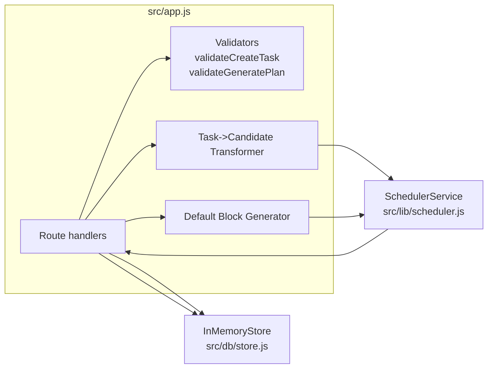
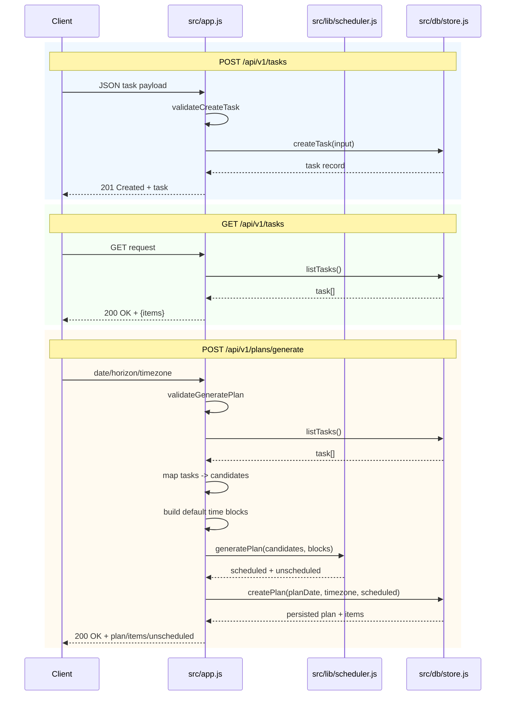

# To-Do Agent Backend Architecture (C4 + Data Flow)

This document maps directly to the current codebase so implementation can proceed module-by-module with minimal refactor risk.

## 1) C4 Context Diagram (Level 1)

### Current file mapping
- Backend entry and routing: `src/index.js`, `src/app.js`.
- Persistence model and migration source: `src/db/store.js`, `src/db/migrate.js`, `docs/postgres_schema.sql`.
- API contract: `docs/openapi.yaml`.
- Quality gates: `test/*.js`, `REVIEW_CHECKLIST.md`.

## 2) C4 Container Diagram (Level 2)

### Container responsibilities
1. **HTTP API container (`src/app.js`)**
   - Validates request payloads.
   - Handles `POST /api/v1/tasks`, `GET /api/v1/tasks`, `POST /api/v1/plans/generate`.
2. **Scheduler container (`src/lib/scheduler.js`)**
   - Candidate ranking and greedy block placement.
   - Returns `scheduled` and `unscheduled` results.
3. **Store container (`src/db/store.js`)**
   - Current in-memory persistence for tasks/plans/plan_items.
   - Replaceable with Postgres implementation later.
4. **Migration runner (`src/db/migrate.js`)**
   - Applies `docs/postgres_schema.sql` via `psql`.
5. **Test container (`test/*`)**
   - Verifies scheduler behavior and endpoint integration.

## 3) C4 Component Diagram (Level 3) for current runtime

### Component boundaries you should preserve
- Keep `SchedulerService` pure (no IO, no DB calls).
- Keep store behind an abstraction (`createTask`, `listTasks`, `createPlan`).
- Keep request validation in API layer, not scheduler.

These boundaries are already reflected by the current files and reduce refactor risk when introducing Postgres-backed repositories.

## 4) Data-flow diagram for current endpoints

## 5) Module-by-module implementation plan (low refactor risk)

### Module 1: Storage abstraction hardening
- Introduce an interface contract for store methods used by `src/app.js`:
  - `createTask`
  - `listTasks`
  - `createPlan`
- Keep `InMemoryStore` behavior unchanged.
- Add `PostgresStore` with same method signatures.

### Module 2: Database-backed persistence
- Implement `PostgresStore` with SQL aligned to `docs/postgres_schema.sql`.
- Wire `src/index.js` to choose `InMemoryStore` or `PostgresStore` by env flag.

### Module 3: Validation hardening
- Align `src/app.js` validation rules with `docs/openapi.yaml` fields and constraints.
- Add negative integration tests for validation failures.

### Module 4: Scheduling configurability
- Move block generation into a helper module.
- Make workday window/timezone configurable.

### Module 5: Agent + policy flow
- Add endpoints for action proposal/decision/execution from OpenAPI.
- Persist actions and policy checks using schema tables.

## 6) Refactor safety checklist

1. Keep route signatures stable (`/api/v1/tasks`, `/api/v1/plans/generate`).
2. Preserve scheduler input/output shape expected by integration tests.
3. Ensure tests run in memory without DB for speed.
4. Add DB integration tests separately (opt-in with `DATABASE_URL`).
5. Keep OpenAPI and SQL docs updated when runtime behavior changes.
